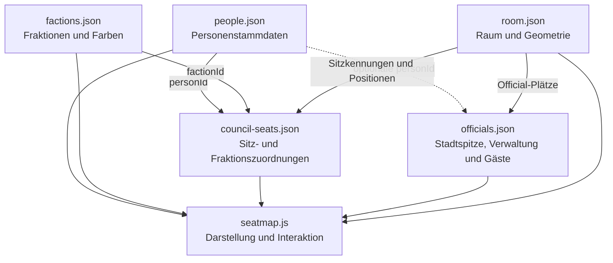
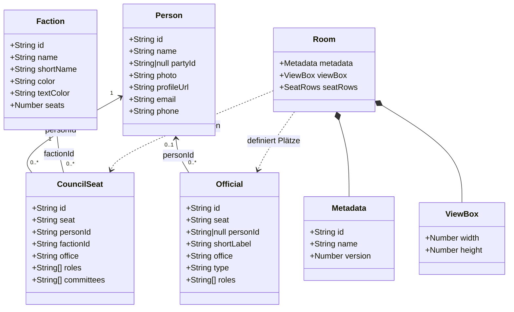

# Datenmodell

## Überblick

Die Anwendung trennt bewusst zwischen Personen, Sitzzuordnungen,
Fraktionen, Officials und Raumgeometrie. 

Dieses Dokument beschreibt das logische Datenmodell.

Es dokumentiert sowohl den aktuellen Stand als auch bereits
beschlossene Zielstrukturen zukünftiger Versionen.

| Datei | Aufgabe |
|-------|----------|
| `factions.json` | Fraktionen und Farben |
| `persons.json` | Stammdaten der Personen |
| `council-seats.json` | Zuordnung Person ↔ Sitz ↔ Fraktion |
| `officials.json` | Stadtspitze, Verwaltung und Gäste |
| `room.json` | Räumliche Anordnung des Sitzungssaals |

## Beziehungen der Datenquellen

Das folgende Diagramm zeigt, wie die verschiedenen Datenquellen
miteinander verbunden sind.

## Vereinfachtes UML-Datenmodell

> Die Beziehungen zwischen `room.json`, den Stadtratssitzen und den
> Official-Plätzen beschreiben das geplante Zielmodell. Die Koordinaten
> werden erst in nachfolgenden Issues aus `seatmap.js` und
> `officials.json` in die Raumkonfiguration verschoben.

## factions.json

Beschreibt ausschließlich Fraktionen.

Enthält beispielsweise:

- Name
- Kurzname
- Farben
- Anzahl der Sitze

Enthält keine Personen.

## persons.json

Beschreibt Personen unabhängig von ihrer Sitzposition.

Enthält keine Koordinaten des Sitzungssaals.

## council-seats.json

Ordnet Personen einer Sitzposition und einer Fraktion zu.

Enthält keine geometrischen Informationen.

## officials.json

Beschreibt Plätze der Stadtspitze, Verwaltung und Gäste.

Derzeit enthält die Datei zusätzlich Positionsinformationen.

Diese werden künftig nach `room.json` verschoben.

## room.json

Beschreibt ausschließlich den Sitzungssaal.

Aktuell enthält die Datei lediglich das Grundschema.

Später werden hier unter anderem gespeichert:

- SVG ViewBox
- Sitzreihen
- Sitzkoordinaten
- Positionen der Officials
- Tischgeometrie
- Position des Informationsbildschirms

Personenbezogene Informationen werden hier bewusst nicht gespeichert.

## Gemeinsame Personenfelder

| Feld | Typ | Beschreibung |
|---|---|---|
| `id` | String | Eindeutige technische ID |
| `seat` | String | Eindeutige Sitzkennung |
| `name` | String | Anzeigename; darf bei wechselnden Plätzen leer sein |
| `office` | String | Amt oder besondere Funktion |
| `faction` | String oder null | Fraktions-ID |
| `party` | String oder null | Optionale Parteizugehörigkeit |
| `roles` | Array | Weitere Rollen |
| `committees` | Array | Ausschüsse oder Gremien |
| `photo` | String | Relativer Pfad zum Bild |
| `profileUrl` | String | Öffentliche Profiladresse |
| `email` | String | Öffentliche Kontaktadresse |
| `phone` | String | Öffentliche Telefonnummer |

## Officials-spezifische Felder

| Feld | Typ | Beschreibung |
|---|---|---|
| `type` | String | Art des Platzes |
| `shortLabel` | String | Kürzel im Sitzplan |
| `x` | Number | Horizontale SVG-Position |
| `y` | Number | Vertikale SVG-Position |
| `radius` | Number | Radius des sichtbaren Kreises |

> Hinweis:
> Diese Felder dienen derzeit der Darstellung.
> Im Rahmen der Raumkonfiguration (room.json) werden sie künftig
> aus officials.json ausgelagert.

## Konventionen

- Leere Texte werden als `""` gespeichert.
- Nicht vorhandene Zuordnungen werden als `null` gespeichert.
- Listen sind immer Arrays.
- IDs und Sitzkennungen müssen eindeutig sein.

