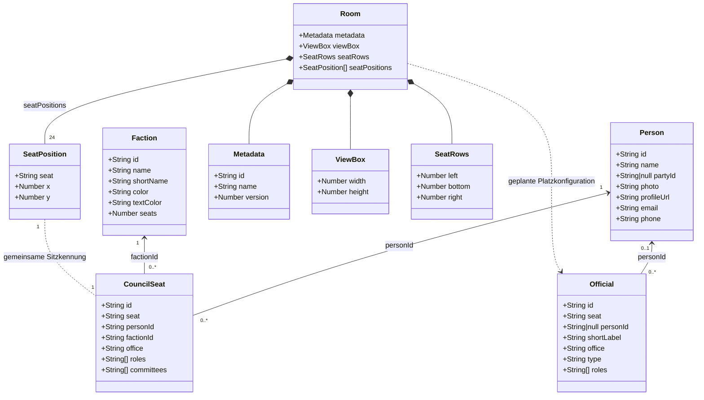
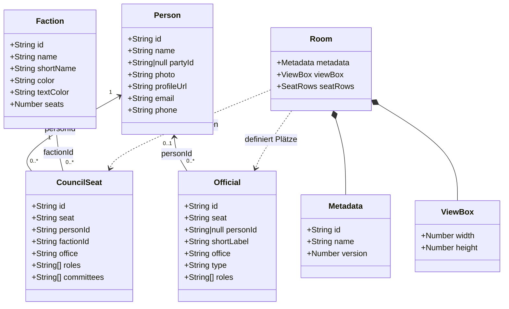

# Datenmodell

## Überblick

Die Anwendung trennt bewusst zwischen Personen, Sitzzuordnungen,
Fraktionen, Officials und Raumgeometrie. 

Dieses Dokument beschreibt das logische Datenmodell.

Es dokumentiert sowohl den aktuellen Stand als auch bereits
beschlossene Zielstrukturen zukünftiger Versionen.

| Datei | Aufgabe |
|-------|----------|
| `factions.json` | Fraktionen und Farben |
| `persons.json` | Stammdaten der Personen |
| `council-seats.json` | Zuordnung Person ↔ Sitz ↔ Fraktion |
| `officials.json` | Stadtspitze, Verwaltung und Gäste |
| `room.json` | Räumliche Anordnung des Sitzungssaals |

## Beziehungen der Datenquellen

Das folgende Diagramm zeigt, wie die verschiedenen Datenquellen
miteinander verbunden sind.



## Vereinfachtes UML-Datenmodell

> Die Sitzpositionen der 24 gewählten Mitglieder werden bereits aus
> `room.json` geladen. Die Positionen der Officials, die Tischgeometrie
> und der zentrale Informationsbildschirm werden in späteren Schritten
> ebenfalls in die Raumkonfiguration überführt.



## factions.json

Beschreibt ausschließlich Fraktionen. Enthält beispielsweise:

- Name
- Kurzname
- Farben
- Anzahl der Sitze

Enthält keine Personen.

## persons.json

Beschreibt Personen unabhängig von ihrer Sitzposition.
Enthält keine Koordinaten des Sitzungssaals.

## council-seats.json

`council-seats.json` ordnet Personen einer Sitzkennung und einer Fraktion zu.

Die Datei enthält keine geometrischen Informationen. Die Position eines Sitzes wird separat über dieselbe Sitzkennung in `room.json` definiert.

Beispiel:

```json
{
  "id": "council-seat-l01",
  "seat": "L01",
  "personId": "person-l01",
  "factionId": "csu",
  "office": "",
  "roles": [
    "Stadtratsmitglied"
  ],
  "committees": []
}

## officials.json

Beschreibt Plätze der Stadtspitze, Verwaltung und Gäste.
Derzeit enthält die Datei zusätzlich Positionsinformationen.
Diese werden künftig nach `room.json` verschoben.

## room.json

`room.json` beschreibt ausschließlich die räumliche Konfiguration des Sitzungssaals.

Die Datei enthält derzeit:

- Metadaten des Raums
- die SVG-ViewBox
- die Anzahl der Sitze je Sitzreihe
- die konkreten SVG-Positionen der 24 Stadtratssitze

Personenbezogene Informationen und politische Zuordnungen werden hier bewusst nicht gespeichert.

### Metadaten

```json
{
  "metadata": {
    "id": "rothenburg-grosser-sitzungssaal",
    "name": "Großer Sitzungssaal",
    "version": 1
  }
}```

### SVG-ViewBox

Die ViewBox definiert das Koordinatensystem der SVG-Darstellung:

```json
{
  "viewBox": {
    "width": 1040,
    "height": 760
  }
}```

### Sitzreihen

`seatRows` dokumentiert die Anzahl der Plätze in den drei Sitzreihen:

```json
{
  "seatRows": {
    "left": {
      "count": 10
    },
    "bottom": {
      "count": 5
    },
    "right": {
      "count": 9
    }
  }
}
```
Die Summe der Sitzreihen ergibt 24 Stadtratssitze.

### Sitzpositionen

Die konkreten Positionen der Stadtratssitze werden im Feld seatPositions definiert.

Jeder Eintrag verbindet eine Sitzkennung mit einer SVG-Position:

```json
{
  "seat": "L01",
  "x": 185,
  "y": 190
}
```
Die Sitzkennung verweist auf den entsprechenden Eintrag in `council-seats.json`.

Dadurch bleiben die Verantwortlichkeiten getrennt:

* `room.json` definiert, wo sich ein Sitz befindet.
* `council-seats.json` definiert, welche Person und Fraktion diesem Sitz zugeordnet sind.
* `people.json` enthält die personenbezogenen Stammdaten.
* `factions.json` enthält Fraktionsnamen und Darstellungsfarben.

Die Anwendung lädt `room.json` beim Start und verwendet `seatPositions` für die Positionierung der 24 interaktiven Sitze.


## Gemeinsame Personenfelder

| Feld | Typ | Beschreibung |
|---|---|---|
| `id` | String | Eindeutige technische ID |
| `seat` | String | Eindeutige Sitzkennung |
| `name` | String | Anzeigename; darf bei wechselnden Plätzen leer sein |
| `office` | String | Amt oder besondere Funktion |
| `faction` | String oder null | Fraktions-ID |
| `party` | String oder null | Optionale Parteizugehörigkeit |
| `roles` | Array | Weitere Rollen |
| `committees` | Array | Ausschüsse oder Gremien |
| `photo` | String | Relativer Pfad zum Bild |
| `profileUrl` | String | Öffentliche Profiladresse |
| `email` | String | Öffentliche Kontaktadresse |
| `phone` | String | Öffentliche Telefonnummer |

## Officials-spezifische Felder

| Feld | Typ | Beschreibung |
|---|---|---|
| `type` | String | Art des Platzes |
| `shortLabel` | String | Kürzel im Sitzplan |
| `x` | Number | Horizontale SVG-Position |
| `y` | Number | Vertikale SVG-Position |
| `radius` | Number | Radius des sichtbaren Kreises |

> Hinweis:
> Diese Felder dienen derzeit der Darstellung.
> Im Rahmen der Raumkonfiguration (room.json) werden sie künftig
> aus officials.json ausgelagert.

## Konventionen

- Leere Texte werden als `""` gespeichert.
- Nicht vorhandene Zuordnungen werden als `null` gespeichert.
- Listen sind immer Arrays.
- IDs und Sitzkennungen müssen eindeutig sein.
- Sitzkennungen müssen zwischen `room.json` und `council-seats.json` übereinstimmen.
- Jede Sitzzuordnung benötigt genau eine räumliche Sitzposition.
