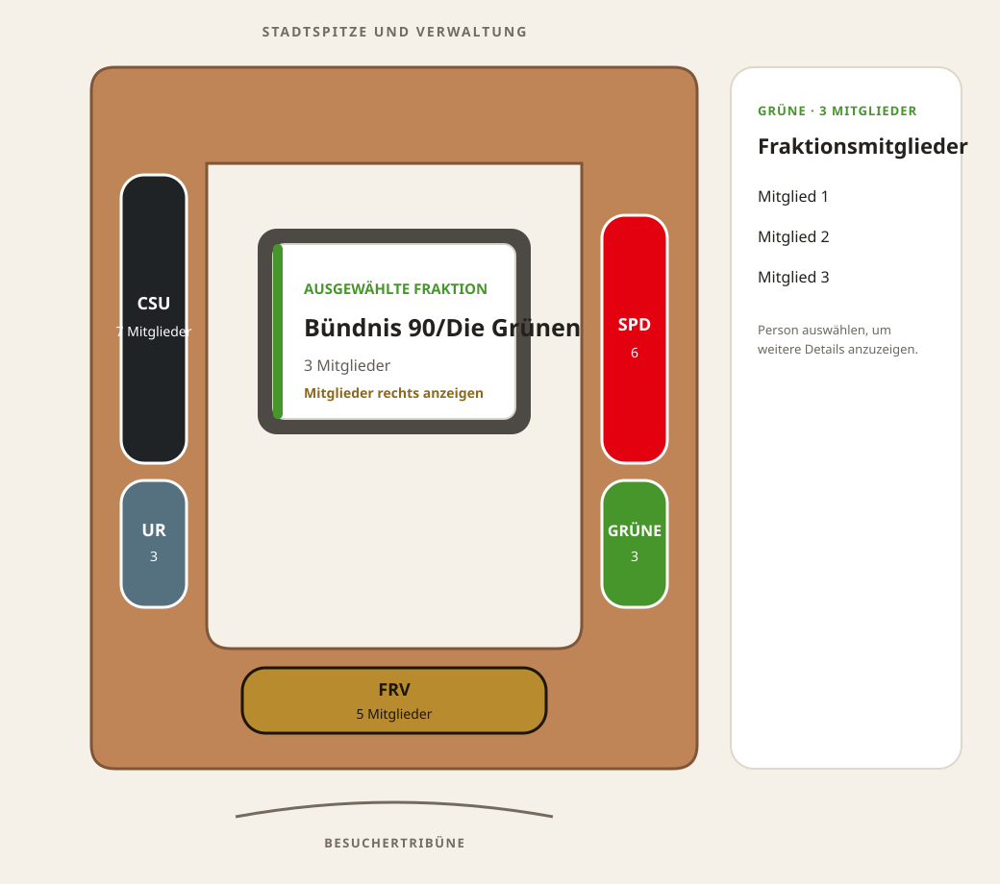

# Fraktionsbereiche im Sitzungssaal

Status: Gestaltungsvorschlag für Issue #57  
Übergeordnet: #56

## Ziel

Die öffentliche Standardansicht soll die ungefähren Bereiche der Fraktionen
zeigen, ohne dauerhaft feste Sitzplätze einzelner Personen zu behaupten. Die
Darstellung bleibt eine schematische Draufsicht aus Sicht der
Besuchertribüne.

## Gestaltungsentscheidung

Die fünf Fraktionen werden als zusammenhängende, abgerundete Segmente auf den
Tischseiten dargestellt. Die Größe eines Segments orientiert sich an der Zahl
der Mitglieder, bleibt aber Teil der konfigurierten Raumgeometrie. Die
bestehenden Fraktionsfarben werden beibehalten.

Die Standardansicht zeigt keine einzelnen Personenkreise. Dadurch verspricht
sie keine Genauigkeit, die bei Abwesenheiten, Platzwechseln oder anderen
Sitzungsformaten nicht gegeben ist. Einzelne Mitglieder bleiben nach Auswahl
einer Fraktion über die Mitgliederliste erreichbar.

## Informationshierarchie

1. Der Fraktionsbereich zeigt Kurzname und Mitgliederzahl.
2. Nach Auswahl zeigt der zentrale Bildschirm Fraktionsname und
   Mitgliederzahl als schnelle räumliche Rückmeldung.
3. Der Informationsbereich zeigt den vollständigen Fraktionsnamen und die
   Liste der Mitglieder.
4. Ein Mitglied kann aus dieser Liste ausgewählt werden, sofern weiterhin eine
   persönliche Detailansicht angeboten wird.

Diese Aufteilung vermeidet lange Namenslisten innerhalb des SVG und hält die
zentrale Anzeige auch auf kleineren Viewports lesbar.

## Visuelle Zustände

| Zustand | Darstellung |
| --- | --- |
| Standard | Fraktionsfarbe, Kurzname, Mitgliederzahl und sichtbare Kontur |
| Hover | leicht angehobener Bereich mit stärkerer Kontur |
| Tastaturfokus | kontrastreicher, mindestens 3 px breiter Fokusring |
| Ausgewählt | stärkere Kontur und Auswahlmarkierung zusätzlich zur Farbe |
| Inaktiv | unveränderte Geometrie; reduzierte Deckkraft nur bei fachlichem Bedarf |

Farbe ist nicht das einzige Unterscheidungsmerkmal: Jeder Bereich besitzt eine
Textbeschriftung und eine Kontur. Auswahl und Fokus müssen zusätzlich sichtbar
und programmatisch erkennbar sein.

## Anordnung für Rothenburg

| Tischbereich | Fraktion | Mitglieder |
| --- | --- | ---: |
| links oben | CSU | 7 |
| links unten | UR | 3 |
| unten | FRV | 5 |
| rechts unten | Grüne | 3 |
| rechts oben | SPD | 6 |

Stadtspitze, Verwaltung und Gäste bleiben separate Funktionsplätze. Sie werden
nicht in Fraktionsbereiche aufgenommen.

## Responsive Verhalten

- Das Raumdiagramm skaliert proportional und behält seine räumliche Anordnung.
- Auf breiten Ansichten steht der Informationsbereich rechts neben dem Plan.
- Auf schmalen Ansichten folgt er direkt unter dem Plan.
- Die Beschriftung innerhalb der Bereiche wird auf Kurzname und Zahl begrenzt.
- Die vollständigen Fraktionsnamen und Mitgliederlisten erscheinen außerhalb
  des SVG, damit sie umbrechen und vergrößert werden können.
- Jeder auswählbare Bereich erhält unabhängig von seiner sichtbaren Form eine
  ausreichend große Interaktionsfläche.

## Offene Architekturfragen

Diese Gestaltung legt noch kein JSON-Schema fest. Issue #58 entscheidet unter
anderem, wie Segmentgeometrie, Reihenfolge und Fraktionsreferenz konfiguriert
werden und ob eine optionale Einzelsitzansicht später unterstützt wird.

## Empfehlung für die Umsetzung

Fraktionsbereiche werden zur Standardansicht. Eine umschaltbare Ansicht mit
festen Personensitzen wird vorerst nicht angeboten, kann aber im Datenmodell als
spätere Erweiterungsmöglichkeit berücksichtigt werden. So bleibt der erste
Umsetzungsschritt verständlich und überschaubar.

