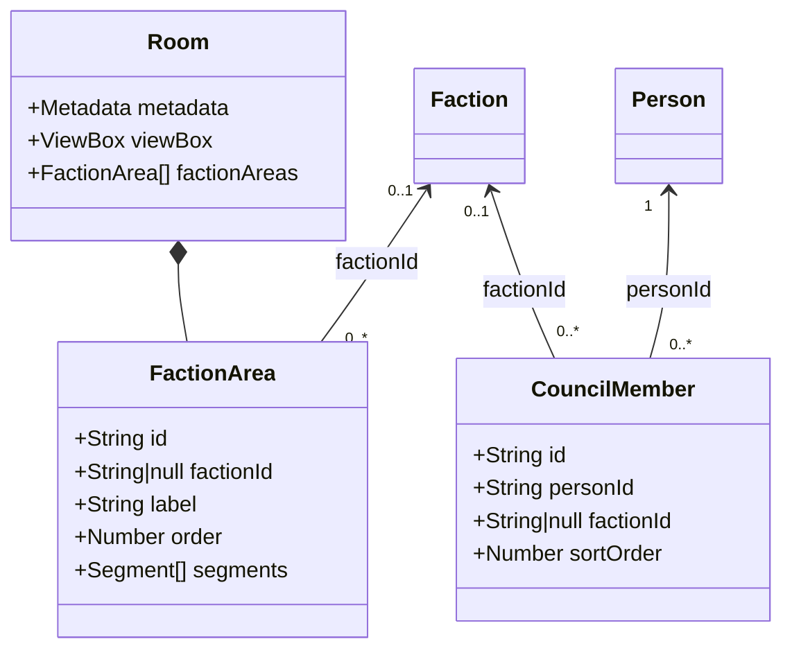

# Fraktionsbereiche im Datenmodell

Status: Architekturentscheidung für Issue #58  
Übergeordnet: #56  
Visuelles Konzept: #57

## Entscheidung

Die Raumkonfiguration beschreibt künftig Fraktionsbereiche statt einzelner
Personensitze. Personen und ihre politische Zuordnung werden in einer eigenen
Mitgliederdatei verwaltet. Damit besteht keine Beziehung mehr zwischen einer
Person und einer festen SVG-Koordinate.

Das Zielmodell führt zwei Strukturen ein:

- `room.json` erhält `factionAreas` mit rein räumlichen Angaben.
- `council-members.json` beschreibt Mitgliedschaft, Fraktion und Funktionen
  ohne Sitzkennung.

Die vorhandenen `seatPositions` und `council-seats.json` bleiben während der
Migration als Version-1-Format lesbar. Sie gehören nicht zum endgültigen
Zielmodell.

## Verantwortlichkeiten

| Datei | Verantwortung im Zielmodell | Enthält ausdrücklich nicht |
| --- | --- | --- |
| `room.json` | ViewBox, Fraktionsbereiche und weitere Raumgeometrie | Personen, Mitgliederzahl, politische Stammdaten |
| `factions.json` | Name, Kurzname und Darstellungsfarben einer Fraktion | Personen und Raumkoordinaten |
| `persons.json` | Wiederverwendbare personenbezogene Stammdaten | Fraktionsbereich und Raumkoordinaten |
| `council-members.json` | Mitgliedschaft einer Person im Rat, Fraktion, Rollen und Sortierung | Sitzkennung und Raumkoordinaten |
| `officials.json` | Stadtspitze, Verwaltung, Gäste und deren Funktionen | Fraktionsbereiche |
| `ui-texts.json` | Redaktionelle Texte der Benutzeroberfläche | Raum- und Mitgliedsdaten |

## room.json

Die Metadaten erhalten eine `schemaVersion`. Version 2 kennzeichnet das
bereichsbasierte Format.

```json
{
  "metadata": {
    "id": "rothenburg-grosser-sitzungssaal",
    "name": "Großer Sitzungssaal",
    "schemaVersion": 2
  },
  "viewBox": {
    "width": 1040,
    "height": 920
  },
  "factionAreas": []
}
```

### factionAreas

Ein Fraktionsbereich referenziert eine Fraktion und enthält mindestens ein
abgerundetes Segment. Mehrere Segmente erlauben später auch Räume, in denen
eine Fraktion nicht als ein einziges Rechteck dargestellt werden kann.

```json
{
  "id": "faction-area-csu",
  "factionId": "csu",
  "order": 1,
  "segments": [
    {
      "x": 151,
      "y": 177,
      "width": 68,
      "height": 310,
      "radius": 24
    }
  ]
}
```

| Feld | Typ | Bedeutung |
| --- | --- | --- |
| `id` | String | Eindeutige technische ID des Bereichs |
| `factionId` | String oder `null` | Referenz auf `factions.json`; `null` steht für einen fraktionslosen Bereich |
| `label` | String, optional | Pflicht bei `factionId: null`, beispielsweise „Fraktionslos“ |
| `order` | positive Ganzzahl | Stabile Bedien- und Lesereihenfolge |
| `segments` | Array | Mindestens ein räumliches Segment |
| `segments[].x` | Zahl | Linke SVG-Koordinate |
| `segments[].y` | Zahl | Obere SVG-Koordinate |
| `segments[].width` | positive Zahl | Breite des Segments |
| `segments[].height` | positive Zahl | Höhe des Segments |
| `segments[].radius` | nichtnegative Zahl | Eckenradius, höchstens die halbe kürzere Kante |

Die Raumkonfiguration speichert keine Mitgliederzahl. Die sichtbare Zahl wird
aus `council-members.json` abgeleitet. Dadurch müssen Raumdaten bei
Personalwechseln nicht angepasst werden. Die Segmentgröße wird explizit
konfiguriert, weil sie neben der Mitgliederzahl auch von Tischform, Abständen
und lesbarer Beschriftung abhängt.

## council-members.json

Die Mitgliedschaft ersetzt im Zielmodell die sitzbezogene Zuordnung aus
`council-seats.json`.

```json
{
  "id": "council-member-person-l01",
  "personId": "person-l01",
  "factionId": "csu",
  "office": "",
  "roles": [
    "Stadtratsmitglied"
  ],
  "committees": [],
  "sortOrder": 1
}
```

`factionId` darf `null` sein, wenn ein Mitglied keiner Fraktion angehört.
`sortOrder` legt ausschließlich die Reihenfolge innerhalb der Mitgliederliste
fest und hat keine räumliche Bedeutung.

## Beziehungen



Die gemeinsame `factionId` verbindet einen Bereich mit seinen Mitgliedern.
Ein `CouncilMember` verweist niemals auf eine `FactionArea`; dadurch kann
dieselbe Ratszusammensetzung mit unterschiedlichen Raumkonfigurationen genutzt
werden.

## Feste Funktionsplätze

Stadtspitze, Verwaltung und geladene Gäste bleiben in `officials.json`. Ihre
spätere räumliche Konfiguration wird unabhängig von `factionAreas` in
`room.json` abgelegt. Sie benötigen weder `factionId` noch einen künstlichen
Fraktionsbereich.

## Validierungsregeln

Für das Version-2-Format gelten mindestens folgende Regeln:

1. `metadata.schemaVersion` ist `2`.
2. IDs und `order` aller Fraktionsbereiche sind eindeutig.
3. Jeder Bereich enthält mindestens ein Segment.
4. Koordinaten sind endlich; Breite und Höhe sind größer als null.
5. Jedes Segment liegt vollständig innerhalb der ViewBox.
6. Der Radius ist nicht negativ und geometrisch zulässig.
7. Eine gesetzte `factionId` existiert in `factions.json`.
8. Bei `factionId: null` ist ein nichtleeres `label` vorhanden.
9. Jede `personId` in `council-members.json` existiert in `persons.json`.
10. Eine Person kommt in derselben Ratszusammensetzung höchstens einmal vor.
11. Eine gesetzte Mitglieds-`factionId` besitzt genau einen sichtbaren Bereich.
12. Fraktionslose Mitglieder besitzen einen Bereich mit `factionId: null`.

Eine geometrische Überschneidungsprüfung zwischen Segmenten ist sinnvoll,
soll aber begründete Sonderformen nicht grundsätzlich verhindern. Sie wird
daher zunächst als Warnung und nicht als Schemafehler behandelt.

## Rückwärtskompatibilität und Migration

Die Umstellung erfolgt in kleinen, überprüfbaren Schritten:

1. Das neue Format und seine Validierung ergänzen, ohne bestehende Daten zu
   verändern.
2. `council-members.json` einmalig aus `council-seats.json` ableiten; dabei
   `seat` entfernen und eine fachliche `sortOrder` vergeben.
3. `factionAreas` für Rothenburg in `room.json` ergänzen und die
   `schemaVersion` auf 2 erhöhen.
4. Die Anwendung verwendet `factionAreas`, sobald Version 2 erkannt wird.
   Version 1 rendert übergangsweise weiterhin `seatPositions`.
5. Nach erfolgreicher visueller Abnahme und aktualisierten Tests die
   Version-1-Felder `seatRows` und `seatPositions` sowie
   `council-seats.json` entfernen.

Diese Erkennung erlaubt die Migration, ohne zwei gleichzeitig sichtbare Modi
in der Benutzeroberfläche anzubieten. Ein späterer echter Hybridmodus kann
ergänzt werden, ist aber keine Voraussetzung für die erste Umsetzung.

## Folgen der Entscheidung

- Personenwechsel erfordern keine Änderung der Raumgeometrie.
- Fraktionsbereiche können pro Raum frei angeordnet werden.
- Mitgliederlisten und persönliche Details bleiben möglich.
- Abwesenheiten oder sitzungsspezifische Besetzungen sind noch nicht Teil
  dieses Modells; sie werden im späteren Multi-Council-Issue #61 behandelt.
- Die produktiven JSON-Dateien werden in diesem Issue noch nicht migriert.
